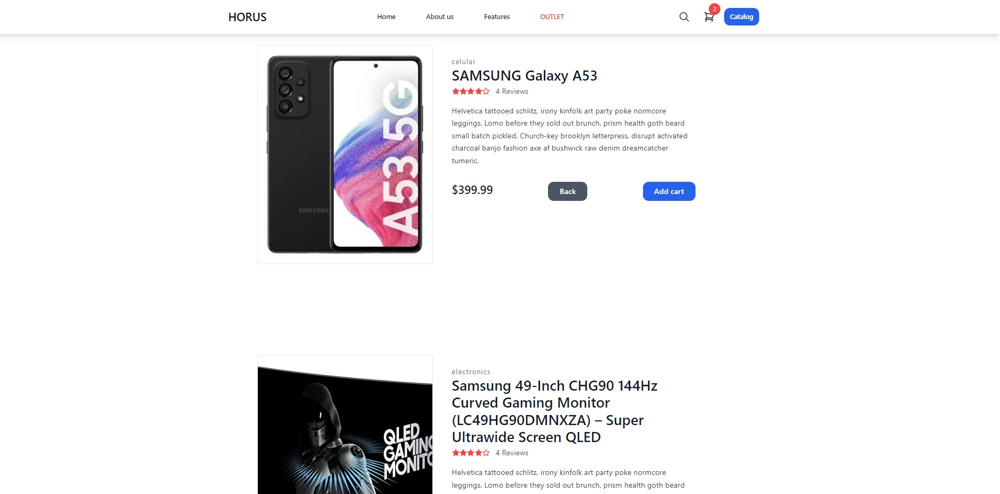

# EcommerceAngular con Tailwind

Primera parte: Maquetacion

Empezamos dandole diseño a la pagina, la cual vengo haciendo uso de Tailwild, gracias a los conocimientos previos con Bootstrap se me facilito el adaptarme a Tailwind. Cree las diversas carpetas para representar un mejor orden de los components y mantener bien estructurada la pagina. Con la ayuda de componentes de Tailwind se me facilito su uso, le di una distincion en cada componente para tener un estilo unico, para la navegacion entre paginas hice uso del enrutamiento que viene con Angular y para tener el vinculo entre componentes el uso de los Modulos.
Con esto hecho solo queda iterar sobre las tarjetas mediante el uso de los servicios que van a traer todos los datos de la API o de un Json.

Segunda parte: Funcionamiento

Para los productos hice uso tanto de una API como un archivo Json el cual genere e hice la implementacion en el template como tambien para darle uso por medio de Service para traer los datos para asi inyectarlos en los diversos components mediante Directivas tanto como iterar sobre los productos como para los condicionales, los productos se almacenan en el localStorage.
Dicho esto genere un CRUD para el carrito el cual mediante el uso de directivas y funciones genere las conexiones para tener actualizado el total, ya sea si se elimina un producto o se agrega se actualizan los valores especificando su moneda con un Pipe.
Para hacer la busquedas filtradas hice uso de RxJS haciendo uso de BehaviorSubject haciendo el filtro para las busquedas y para simplificar codigo, me ahorre codigo haciendo la busqueda y mostrando los resultados en el componente Detail, el mismo que tiene cada uno de los productos, quiere decir que al hacer la busqueda nos va a mandar al Detail del producto con su titulo/id de esa manera quise ahorrar el crear un componente nuevo para la busqueda. Con RxJs maneje errores como tambien observables y el uso de map para iterar de cierta forma por los productos.
Se que podria haber hecho uso de BehaviorSubject en varios casos de mi aplicacion pero tambien quise tener el reto de generar un codigo extenso en el cual no hacia solo uso de BehaviorSubject y dar por finalizada la aplicacion, ejemplo tener una funcion que se comparte en diversos componentes y no tener que estar haciendo simplemente el uso de BehaviorSubject.
Navegue entre rutas mediante el Enrutamiento como tambien en el detalle de las tarjetas donde coloque como parametro el id de los productos para mostrar caracteristicas en el Details el cual al seleccionarlo nos lleva hasta ahi, sin olvidar que cree las interfaces para cada una de API/JSON.

Cambios en abril: Aplicando lazy loading y un swiper para el estilo del slider de productos, sin olvidarme de el autoDestroy.

